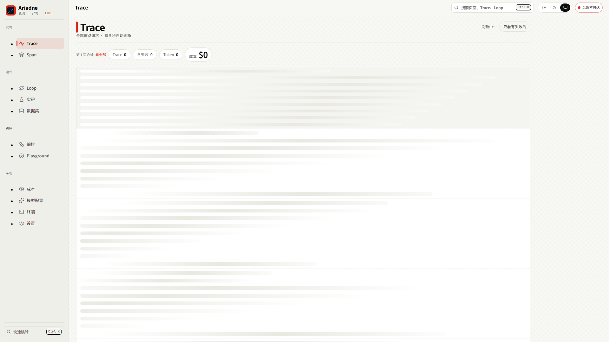
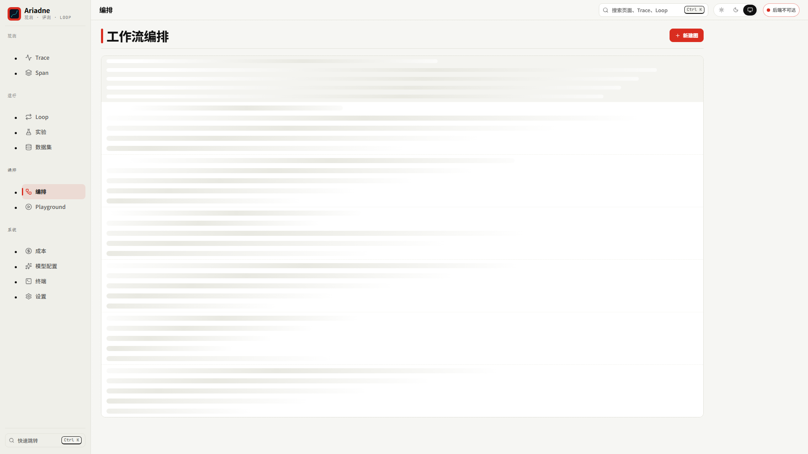
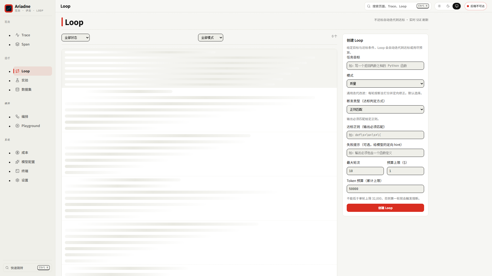
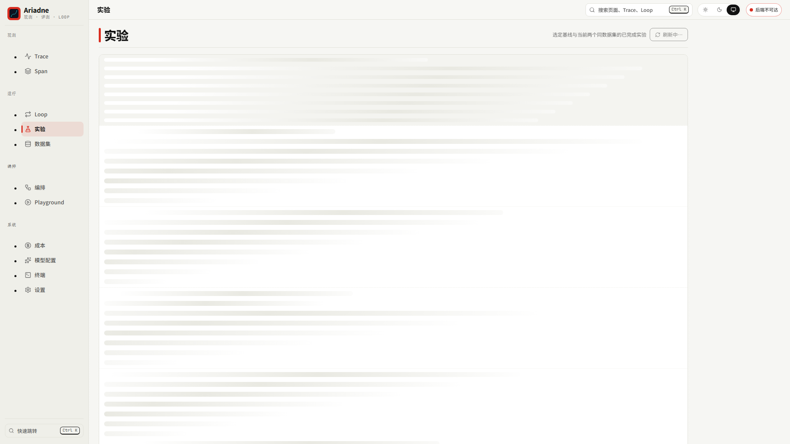
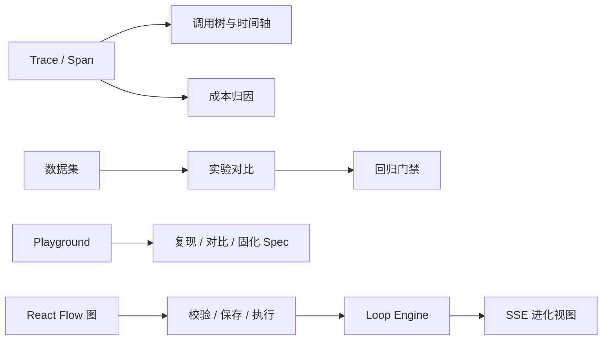

# Ariadne

AI 工作流质量保障与可观测性平台。Ariadne 把一次模型调用变成一条可回溯、可验证、可自动修正的链路：先采集 Trace，再用评测和 Harness 判断结果，最后由 Loop Engine 在预算内迭代到达标。

> 当前目标平台：Windows。前端使用 React 19 + TypeScript + Vite，后端使用 FastAPI + ClickHouse + PostgreSQL + Redis。

## 先看效果

界面提供日间 / 夜间 / 跟随系统三档配色，顶栏即可切换，选择会记住。下面的截图各挑了一种配色。

### Trace 观测

列表页按状态、耗时、Span、Token、成本和模型快速扫描；点击一行可进入调用树，在调用树与时间轴之间切换。



### 图编排

React Flow 画布支持 LLM、工具、RAG、代码、分支、Loop、评估和子图节点。节点可配置、自动布局、校验并保存为版本化 Workflow Graph。节点颜色区分类型，右下角缩略图用于定位大型工作流。



### Loop 闭环

Loop 详情页把每一轮的断言结果、失败证据、预算消耗和产出物摊开：达标与否由外部验证器判定，不采信模型自称完成。



### 实验对比

批量实验按指标聚合，支持样本级差异下钻与回归门禁。



## 能做什么

| 模块 | 能力 |
| --- | --- |
| Trace / Span | 调用树、时间轴、失败筛选、游标分页、模型与成本明细 |
| 评测 | 数据集版本、批量实验、指标对比、样本级差异、回归门禁 |
| Loop | 目标校验、Ralph 外部验证、Critique、预算熔断、检查点恢复、SSE 状态流、产出物落盘 |
| Harness | PII / Prompt Injection / 引用 / 危险命令规则，支持 allow、warn、block、rewrite、route、approval |
| 图编排 | DAG 校验、类型兼容、条件分支、并发执行、Loop 子图、多 Agent 子图、LangGraph 导入、YAML 双向序列化 |
| Playground | Prompt 调试工具：多配置对比、从 Span 复现、请求组装、一键固化为 `spec.yaml`（客户端执行） |
| 模型配置 | 自定义显示名称、Provider、模型 ID、API Key、Base URL、降级模型和默认模型 |
| 成本归因 | 按模型、Provider、小时或天聚合，支持下钻到 Span |
| SDK | Python / TypeScript，OpenAI / Anthropic 自动埋点，OTLP / OpenInference 适配 |
| 生产化 | RBAC、Argon2id、JWT、租户隔离、审计、S3、TTL、GDPR 删除、Prometheus、Helm |

## 前端工作台



当前前端路由：

| 路由 | 用途 |
| --- | --- |
| `/traces` / `/spans` | 链路与 Span 观测 |
| `/loops` | Loop 列表、状态、预算与迭代 |
| `/experiments` / `/datasets` | 离线评测与数据集版本 |
| `/graphs` | 工作流图列表与 React Flow 编辑器 |
| `/playground` | Prompt 调试、配置对比、请求组装、固化为 Spec（客户端执行，平台不持有密钥） |
| `/models` | 模型端点配置 |
| `/costs` | 成本分组与趋势 |
| `/terminal` | 内置终端会话 |
| `/settings` | API Key、健康状态、管道状态 |

前端还包含这些容易被忽略但已实现的交互：

- 移动端侧栏抽屉、遮罩和 Escape 关闭。
- 图编辑器和模型配置表单的未保存修改守卫。
- 对话框焦点回收、Escape 关闭和 Tab 陷阱。
- Trace 树虚拟滚动、游标分页和路由级懒加载。
- ECharts、React Flow、xterm 独立 chunk，减少首屏加载。
- **响应式三断点布局**（< 768px / 768-1024px / > 1024px），卡片自适应列数，表格在窄屏折叠为卡片。
- **暗色模式**：Newsprint 风格双主题，单份令牌通过 `light-dark()` 自动切换，跟随系统或手动覆盖。
- **字体系统**：Noto Sans SC Variable 800 字重粗体中文 + Inter Variable 拉丁 + JetBrains Mono 等宽，全部自托管可离线。
- **圆角设计**：卡片 14px、按钮 8px、输入框 10px、标签 999px，全站统一令牌无硬编码。
- **触控优化**：44×44px 最小触控目标，抽屉下滑手势，DAG 图支持双指缩放。
- **无障碍**：键盘导航、ARIA 标签、焦点可见、WCAG AA 对比度、状态不依赖颜色、图表提供数据表格替代。

## 快速开始

### 方式 A：完整栈

环境要求：Windows 10/11、Docker Desktop、Python 3.11+、uv、Node.js 18+。

```powershell
docker compose up -d
```

Compose 会启动 ClickHouse、PostgreSQL、Redis、迁移任务、API 和 Worker。控制台地址为 <http://localhost:8000>，API 文档为 <http://localhost:8000/docs>。

生成一组演示数据：

```powershell
uv sync --all-extras
uv run python examples/demo_rag.py
```

默认开发 key 为 `ak_local_dev_key`。生产环境请通过 `ARIADNE_API_KEY` / `ARIADNE_API_STATIC_API_KEY` 注入，不要把真实密钥写进仓库。

**生产部署**请参考 [部署指南](docs/14-deployment-guide.md)，包含 Docker Compose、Kubernetes + Helm、安全加固清单和故障排查。

### 方式 B：只看前端

无需启动数据库，使用确定性 mock API：

```powershell
cd web
npm install
$env:VITE_MOCK = "1"
npm run dev
```

打开 <http://localhost:5173>。mock 数据覆盖所有顶级页面，适合 UI 开发、截图和交互检查。

### 桌面端

项目包含 Tauri 2 壳层。桌面端默认连接 `http://127.0.0.1:8000`，可在“设置”页修改后端地址。

```powershell
cd web
npm run desktop:dev
```

## 前端验证

在 `web/` 目录执行：

```powershell
npm run typecheck
npm test
npm run build
npm run e2e
```

当前基线：

- Vitest：61 tests passed。
- Vite：使用干净输出目录的生产构建通过（Windows 上若默认 `dist/` 被运行中的进程占用，可能出现 `EPERM`，不影响构建本身）。
- Playwright：22 passed / 2 skipped，覆盖 desktop、tablet、mobile。
- 顶级页面运行时烟测：11 个页面在三档视口均无 `pageerror`、错误级控制台日志或资源 404。
- `npm test` 已限定为 `src/**/*.test.{ts,tsx}`，不会再误收集 Playwright 用例。

## 后端验证

```powershell
uv run pytest -m "not integration"
uv run ruff check .
uv run mypy src/
uv run pytest -m integration
```

当前完整运行基线：**2211 passed / 25 skipped / 1 xfailed**（唯一 xfail 钉住的是红队用例集里不构成漏洞的 `pytest | sh` 用例，见 `tests/redteam_cases.py`；`npx`/`npm` 供应链缺口已于 2026-09-02 由 `ExecPolicy` 参数白名单闭合）；`ruff check` 与 `mypy src/` 全绿。最新审计与未完成项见 [项目审计报告](docs/12-audit-report.md)。

`integration` 需要真实 ClickHouse、PostgreSQL 和 Redis。数据库层的 SQLite 兼容测试不能替代 PostgreSQL RLS、ClickHouse 聚合语法和 Compose 编排验证。

M3 闭环验收基准可单独跑（真落盘、真执行 pytest，约 80 秒）：

```powershell
uv run pytest tests/test_loop_benchmark.py -s
```

## 当前状态与未完成事项

**完整项目状态**请参考 [项目状态报告（2026-09-03）](docs/16-project-status-2026-09-03.md)，包含里程碑完成情况、P0-P2 闭环状态、测试覆盖、适用场景判定和下一步建议。

### 已完成

- M1-M6 全部完成（可观测、评测、Loop、Harness、编排、生产化）。
- 前端核心页面、模型配置、Playground、图编排、移动端响应式和未保存守卫已验证。
- Windows 受限子进程路径已接入 Job Object 资源限制；Linux 专用沙箱后端仍按能力探测和降级策略处理。
- **M3 闭环验收已完成**（2026-09-01）：假完成拦截率 27/27 = 100%、闭环达标率 17/17 = 100%、平均 2.00 轮，用例集 `tests/loop_cases.py` 真跑 pytest。详见 [M3-spec 第 11 节](docs/M3-spec.md)。
- **P0-P2 全部闭环**（2026-09-03）：13 个关键缺陷全部修复，详见[审计报告](docs/12-audit-report.md)。

### 仍需后续验证或补强

1. **真实容器验收**：已完成（2026-09-03）——`docker compose` 全栈、PostgreSQL RLS（含跨租户隔离与连接池污染加固）、ClickHouse 物化视图（含成本 token 新维度）、Redis 队列、GDPR 删除全链路与 Loop 端到端均实证通过，详见[审计报告](docs/12-audit-report.md)的”真实基础设施验收”节；集成测试 `pytest -m integration` 28/28 全绿。仍欠：真实 LLM 调用（需 provider key）。
2. **Windows 安全边界**：gVisor / Firecracker / network namespace 属于 Linux 能力；Windows 生产路径不能提供同等级的禁网和 syscall 隔离，因此不应在本机执行不可信代码（`ARIADNE_SANDBOX_ALLOW_UNTRUSTED_CODE` 必须保持 false）。供应链面已收窄：`npx` 包名与 `npm` 子命令/脚本均在 `ExecPolicy` 白名单内，registry 下载类命令默认拒绝。
3. **性能预算**：构建时 ECharts chunk 为 599KB（gzip 后 205KB），超过 500KB 警告阈值但功能不受影响。已做按需引入（仅 Line/Bar/Pie）+ manual chunks 分割 + 路由懒加载，这是该配置的最优结果。
4. **数据规模验证**：前端已有虚拟滚动和分页，但百万级 Trace、真实网络延迟、对象存储冷热切换仍需要压测环境确认。
5. **密钥与部署**：生产部署前需替换开发 key、配置真实 S3/MinIO、JWT secret、RBAC 用户和 Prometheus/Grafana 告警接收器。

### 真实 LLM 能力验收（可选）

M3 闭环验收已完成（机制验收），如需验证真实 LLM 能力：

```bash
# 1. 配置 provider key
cp .env.example .env
# 编辑 .env，取消注释并填入真实 ANTHROPIC_API_KEY 或 OPENAI_API_KEY
export RUN_LLM_CAPABILITY_TESTS=1

# 2. 运行能力验收（成本约 $50-100）
uv run pytest tests/test_llm_capability.py -v --tb=short

# 3. 仅跑简单用例（成本约 $10）
uv run pytest tests/test_llm_capability.py::test_anthropic_capability_easy -v

# 4. 查看报告
cat capability_report_*.json
```

详见 [真实 LLM 能力验收框架](docs/13-llm-capability-verification.md)。

这些事项不会阻塞当前前端开发和 mock 体验，但会影响”可直接用于生产”的最终验收。

## Playground 工作原理

Playground 是**客户端请求组装器**，不是服务端 LLM 执行器：

- **API 行为**：`/playground/run` 和 `/playground/compare` 端点校验参数并返回组装好的请求配置，**不调用 Provider**。
- **密钥管理**：平台不持有或存储用户的 Provider API Key，所有 LLM 调用由客户端（前端或本地脚本）直接向 Provider 发起。
- **定位**：快速调试工具，用于对比不同配置的效果、从历史 Span 复现问题、将调试好的配置固化为 `spec.yaml` 进入版本控制。
- **与 Loop 的区别**：Playground 是单次调用的实验台，不做迭代收敛；调试完成后”固化为 Spec”或”创建 Loop”才进入自动修正流程。

如果需要服务端执行能力（Job 管理、成本/Trace 落库、取消/重试），应使用 Loop API 或 Graph 执行端点。

## 导入 LangGraph 图

已有的 LangGraph 图不需要重写。`POST /v1/graphs/import-langgraph` 接受 `StateGraph`
的内部结构，转换成 Ariadne 的 Workflow Graph：节点映射为工具节点，简单边照搬，
条件边展开成分支节点加路由表。不支持的构造（多源 fan-in、运行时决定的路由）显式
报错，不静默降级。

```powershell
curl -X POST http://localhost:8000/v1/graphs/import-langgraph `
  -H "X-Ariadne-Key: ak_local_dev_key" -H "Content-Type: application/json" `
  -d '{
    "nodes": {"retrieve": {}, "grade": {}, "generate": {}, "fallback": {}},
    "edges": [["__start__", "retrieve"], ["retrieve", "grade"]],
    "branches": {"grade": {"decide": {"ends": {"yes": "generate", "no": "fallback"}}}},
    "name": "rag-with-grading"
  }'
```

`name` 留空则只转换并校验、不落库，用来先看转换结果。校验不通过返回 422 并列出原因，
重名返回 409。Python 侧也可以直接传 `StateGraph` 实例给 `import_langgraph()`，它按
属性名鸭子类型读取，不硬依赖 langgraph 包。

注意 LangGraph 的回边不能直接导入。LangGraph 靠 `checkpointer` 在超步之间循环，
Ariadne 的执行器是 DAG，环由 Loop 节点显式承载，所以 `rewrite → retrieve` 这类
重试边会被环检测拒掉（422）。导入后需要把该回边替换成 Loop 节点，把重试条件写成
断言 —— 这也是刻意的：Loop 的预算与收敛判定要有落点，隐式的无界循环没有。

## SDK 示例

### Python

```python
from ariadne_sdk import init, trace

client = init(api_key="ak_local_dev_key", project="my-app")

@trace(kind="rag")
def retrieve(query: str) -> list[str]:
    return vector_db.search(query, top_k=5)

with client.span("chat", kind="llm", provider="openai", model="gpt-4o") as span:
    response = openai_client.chat.completions.create(...)
    span.set_usage(input_tokens=120, output_tokens=80)
```

OpenAI / Anthropic 也可使用 SDK 的自动埋点包装器，不需要手写 Token 统计。

### TypeScript

```ts
import { init } from "@ariadne/sdk";

const client = init("ak_local_dev_key", { project: "my-app" });

const span = client.span("answer", { kind: "llm", provider: "openai", model: "gpt-4o" });
span.setInput("...").enter();
try {
  const answer = await callModel();
  span.setOutput(answer).end();
} catch (error) {
  span.recordError(error as Error).end();
  throw error;
}
```

## 文档索引

| 文档 | 内容 |
| --- | --- |
| [01 定位与目标](docs/01-vision-and-goals.md) | 目标用户、差异化、成功指标 |
| [02 系统架构](docs/02-architecture.md) | 分层架构和技术选型 |
| [03 Loop 引擎](docs/03-loop-engine.md) | 状态机、Verifier、预算与恢复 |
| [04 Harness 与沙箱](docs/04-harness-and-sandbox.md) | 规则、执行卡点与隔离边界 |
| [05 评测引擎](docs/05-evaluation.md) | 评估器、Judge 与回归门禁 |
| [06 可观测性](docs/06-observability.md) | OTel、采样、脱敏与成本 |
| [07 前端可视化](docs/07-frontend-visualization.md) | 页面、SSE、大数据量优化 |
| [08 数据模型](docs/08-data-model.md) | ClickHouse / PostgreSQL / Redis / S3 |
| [09 API 与 SDK](docs/09-api-and-sdk.md) | REST、SSE、OTLP、SDK、CLI |
| [10 安全与多租户](docs/10-security.md) | RBAC、隔离、密钥与审计 |
| [11 路线图](docs/11-roadmap.md) | 里程碑、风险和开放项 |

## 更新日志

详见 [CHANGELOG.md](CHANGELOG.md)，记录项目演进历史和重要变更。

## 许可

Apache License 2.0，见 [LICENSE](LICENSE)。
